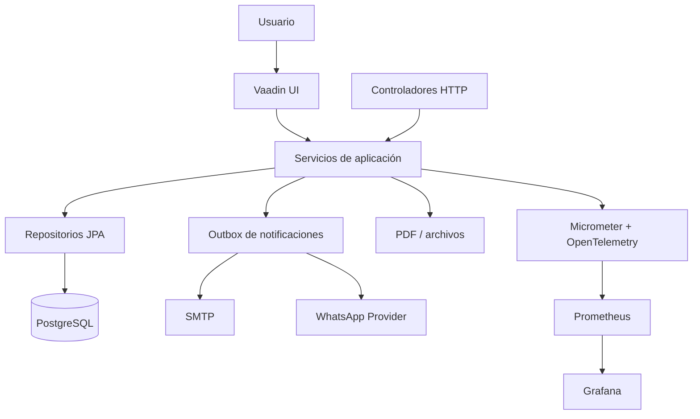
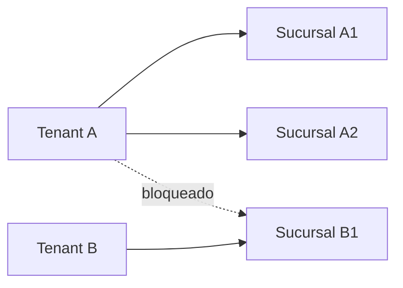

# Arquitectura de Cita Cloud

**Estado:** IMPLEMENTADA  
**Última actualización:** 08/09/2026

Este documento describe la arquitectura encontrada en el repositorio; no representa una arquitectura futura.

## Vista general

Sentry está previsto en la documentación operativa, pero no existe un SDK ni un contenedor Sentry configurado actualmente.

## Frontend y backend

Vaadin ejecuta la interfaz en el mismo proceso de Spring Boot. Las vistas coordinan interacción y delegan reglas a servicios. Los controladores REST cubren caja, descargas, archivos y PDF. No existe un frontend desplegable separado.

Capas actuales:

`views/controllers -> services -> repositories -> models/PostgreSQL`

Los DTO se usan en los contratos nuevos; parte del código histórico aún entrega modelos directamente en algunos endpoints, deuda que debe corregirse gradualmente.

## Identidad, autorización y multitenancy

Spring Security mantiene una sesión `JSESSIONID`. El login combina empresa, usuario y contraseña. `TenantUserDetails` y `TenantContext` aportan la empresa autenticada. Servicios y repositorios aplican `empresa_id`; las relaciones financieras más recientes agregan claves foráneas compuestas para evitar cruces entre tenants.

## Persistencia y transacciones

- PostgreSQL es el motor oficial.
- UUID identifica entidades de negocio.
- Flyway es la única autoridad del esquema; Hibernate usa `validate`.
- Servicios transaccionales coordinan escrituras y auditoría.
- Claves de idempotencia y restricciones únicas protegen pagos, cajas y facturación.
- Versiones optimistas protegen entidades financieras configurables.

## Procesamiento asíncrono e integraciones

Las notificaciones de citas se guardan en `outbox_notificaciones`. Un worker del mismo proceso reclama pendientes, aplica reintentos y delega en `EmailProvider` o `WhatsappProvider`. SMTP y WhatsApp se configuran por ambiente/empresa según corresponda. Documentos y PDF se almacenan en rutas locales configuradas.

## Errores, auditoría y observabilidad

`GlobalExceptionHandler` normaliza errores REST. `RequestIdFilter` asigna un identificador por solicitud; Micrometer produce métricas y el bridge OTel exporta trazas por OTLP. La auditoría responde “quién hizo qué”; la observabilidad responde “qué ocurre técnicamente”.

## Decisiones

- [ADR-001: multitenancy compartido](adr/ADR-001-multitenancy.md)
- [ADR-002: outbox de notificaciones](adr/ADR-002-notification-outbox.md)
- [ADR-003: OpenTelemetry](adr/ADR-003-opentelemetry.md)
