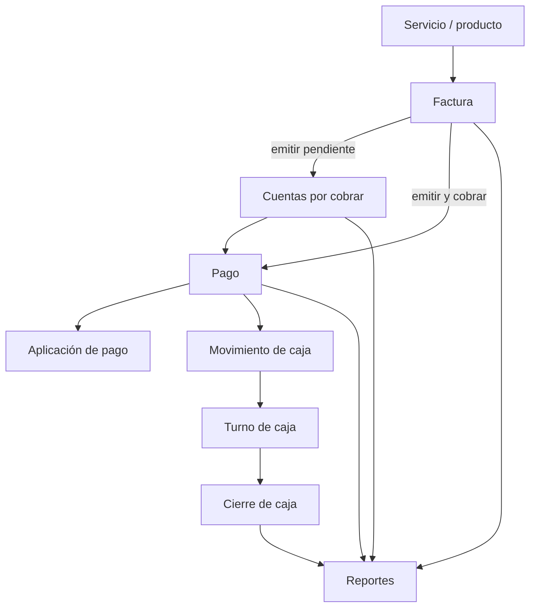

# Diagrama financiero

```mermaid
flowchart TB
  S[Servicio / producto] --> F[Factura]
  F -->|emitir pendiente| CXC[Cuentas por cobrar]
  F -->|emitir y cobrar| P[Pago]
  CXC --> P
  P --> A[Aplicación de pago]
  P --> MC[Movimiento de caja]
  MC --> T[Turno de caja]
  T --> CC[Cierre de caja]
  F --> R[Reportes]
  P --> R
  CXC --> R
  CC --> R
```

Factura, pago, saldo y caja son conceptos relacionados pero no intercambiables.
