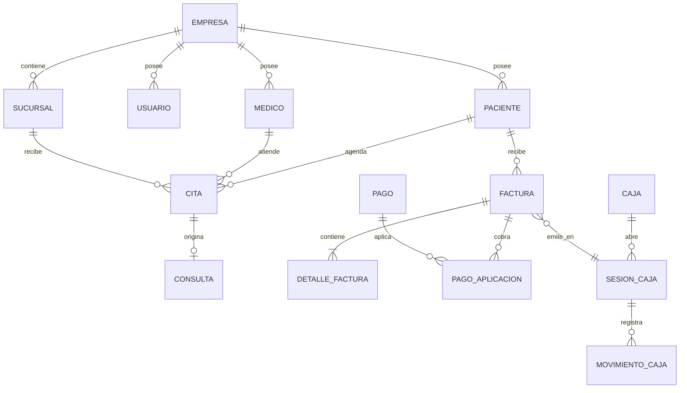

# Base de datos

**Estado:** IMPLEMENTADA  
**Última actualización:** 08/09/2026

## Convenciones

- PostgreSQL; base local oficial `cita_cloud`.
- Esquema administrado exclusivamente por Flyway en `src/main/resources/db/migration`.
- JPA valida el esquema; no crea ni actualiza tablas.
- UUID para claves de negocio; `empresa_id` obligatorio en datos de tenant.
- Importes `NUMERIC(...,2)` y cálculos Java con `BigDecimal`.
- Fechas operativas en `TIMESTAMP`; cualquier cambio de política de zona horaria requiere ADR.
- Índices comienzan con `idx_`; unicidad con `uq_`; checks con `ck_`; claves foráneas con `fk_`.

No se edita una migración aplicada. Todo cambio crea la siguiente versión `V<n>__descripcion.sql` y se prueba primero en una copia no productiva.

## Dominios implementados

| Dominio | Tablas principales |
|---|---|
| Identidad | `empresas`, `usuarios`, `roles`, `permisos`, tablas de relación |
| Clínica | `pacientes`, `medicos`, `citas`, `consultas_medicas`, diagnósticos, tratamientos, recetas y órdenes |
| Documentos | `documentos`, archivos de resultados |
| Finanzas | `facturas`, `detalle_factura`, `pagos`, aplicaciones, cargos, cajas, sesiones y movimientos |
| Inventario | categorías, unidades, productos, existencias, lotes y movimientos |
| Laboratorio | muestras, estudios asociados y resultados versionados |
| Comunicación | notificaciones, destinatarios, entregas, configuración y outbox |
| Control | `auditoria`, reportes y consecutivos técnicos |

## ERD de alto nivel

## Relaciones críticas

- Factura, sucursal, paciente, médico, caja, sesión y secuencia fiscal deben pertenecer a la misma empresa.
- El precio del detalle de factura es un snapshot histórico; cambiar el catálogo no altera una factura existente.
- Precio de venta y costo de inventario representan conceptos distintos.
- Facturado, cobrado, saldo por cobrar y dinero en caja no son equivalentes.
- Una factura emitida requiere caja y turno abiertos; un borrador todavía no.

## Transacciones, concurrencia y respaldo

Pagos, emisión, movimientos de caja y consumo de secuencias deben ser atómicos. Restricciones únicas y versión optimista complementan la validación de servicios. Los respaldos incluyen base y archivos; el procedimiento está en [Backup y restauración](../operations/BACKUP-RESTORE.md).
